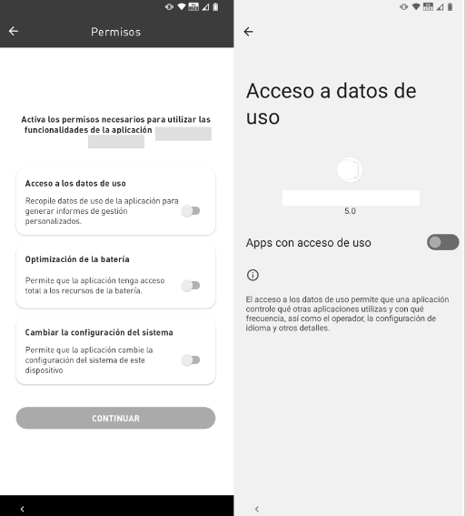

# Activación

1. Para iniciar la activación de la licencia, pulse el botón "Iniciar"
2. Lea y marque la casilla de verificación de los Términos y condiciones de uso de la aplicación y pulse "Aceptar".

<figure><figcaption></figcaption></figure>

3. Al activar el permiso "Acceso a los datos de uso", se mostrará el permiso solicitado.

<figure><figcaption></figcaption></figure>

4. En la secuencia se mostrará una notificación donde deberá pulsar en "Permitir" para seguir con la activación. Habilitar también el permiso Optimización de la Batería.

<figure><figcaption></figcaption></figure>

5. &#x20;Habilitar también el permiso Cambiar configuración del sistema para habilitar y presionar el botón "Continuar":

<figure><figcaption></figcaption></figure>

6. La siguiente pantalla se mostrará para que el usuario desactive el wi-fi para poder seguir con la activación. Haga clic en “Abrir configuración de Wi-Fi” y deshabilite , cuando regrese a esta pantalla, el botón "Continuar" estará habilitado para que pueda finalizar la activación.

<figure><figcaption></figcaption></figure>

7. ¡Felicidades! Su licencia de **\<NomeProduto>** se ha activado con éxito. Pulse Concluir para iniciar el uso del dispositivo.
